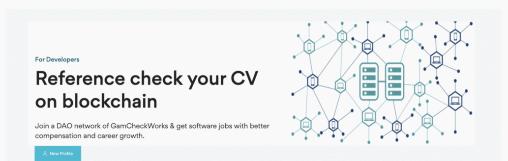

### GamCheckWorks is a platform for talents and clients with low fees (0% talent fee), short processing time (2 hours. for reference checking), and all information is immutable and transparent.  
  
  

=====  
1. Init project with anchor  
    `anchor SolanaCodingCamp`  
    `cd SolanaCodingCamp`  

2. Init reactjs  
    `npx create-react-app app --template typescript`  
    `cd app`  
    `npm start`  

3. Create and mint 1,000,000 token  
    `spl-token create-token`  
    Creating token 5ftoDyQvRRL9wFXmaHVN4vYqfdjWue8woQSQ1T8RpinA  
    Signature: 4DamDJZBGsV9jb6QNjWgCEFDKYMkBJEK1o1cEww9tQ8dxJVBsquamEUEBJg4KFQWyZu3NzWKTe6ABtPDmUs62ifv  

    `spl-token create-account 5ftoDyQvRRL9wFXmaHVN4vYqfdjWue8woQSQ1T8RpinA`  
    Creating account GW9LffcdzG3W5wAoydbgWXosDn7VXv6cB8wevHffqbx8  
    Signature: 2LjeLLUmHNtNjc9doRh1cYAGSkr31hgjtwbTp947KkofqNFxwu8ubNXnXe5YLHdVxLagt1EmmCyxiMc68eB2Uodc  

    `spl-token balance 5ftoDyQvRRL9wFXmaHVN4vYqfdjWue8woQSQ1T8RpinA`  
    0  

    `spl-token mint 5ftoDyQvRRL9wFXmaHVN4vYqfdjWue8woQSQ1T8RpinA 1000000`  
    Minting 1000000 tokens
    Token: 5ftoDyQvRRL9wFXmaHVN4vYqfdjWue8woQSQ1T8RpinA  
    Recipient: GW9LffcdzG3W5wAoydbgWXosDn7VXv6cB8wevHffqbx8  
    Signature: 3yksrxZEvZ6unQbDPyGkvJtSyYvXrUiJQPAUYcbU6To5F8VoTL4mb9DuP1ggcVj5tyU9EJzJwo6BcSU7MVuAHqCu  

    `spl-token authorize 5ftoDyQvRRL9wFXmaHVN4vYqfdjWue8woQSQ1T8RpinA  mint --disable`  
    Updating 5ftoDyQvRRL9wFXmaHVN4vYqfdjWue8woQSQ1T8RpinA  
    Current mint authority: Htyw4uLiERgkNWMJCmtffkUhLwmgs72LXYUJcDoFhLvZ  
    New mint authority: disabled  
    Signature: 4aqr8SUHpUjtTgMeafCQXJeZxQQnRraPHqV6K4Svn11nqwYhU7FuP1gQz5gaajncke6SMPgN9CgQzc8jWjZr2txm  

    `spl-token balance 5ftoDyQvRRL9wFXmaHVN4vYqfdjWue8woQSQ1T8RpinA`  
    1000000  

    `spl-token supply 5ftoDyQvRRL9wFXmaHVN4vYqfdjWue8woQSQ1T8RpinA`  
    1000000  

    `spl-token transfer --fund-recipient 5ftoDyQvRRL9wFXmaHVN4vYqfdjWue8woQSQ1T8RpinA  300000 37NdHQCSR1sa7jGfKcKCufufztTGxv7qaYT4B88kqwCL`  
    Transfer 300000 tokens  
    Sender: GW9LffcdzG3W5wAoydbgWXosDn7VXv6cB8wevHffqbx8  
    Recipient: 37NdHQCSR1sa7jGfKcKCufufztTGxv7qaYT4B88kqwCL  
    Recipient associated token account: 9Qr6V2iQu8JCA9C1NksJLpTwbtthHaoCG6jpredQDBd  
    Funding recipient: 9Qr6V2iQu8JCA9C1NksJLpTwbtthHaoCG6jpredQDBd (0.00203928 SOL)  
    Signature: 5wQLei6gmLMmKrGYb3gRJF9ARnUeCa1LgdNFANGWL8UBCNsvAEFsvFFmcw2zGSRXqc4sfSe7bU99unpHiNvWVqdL  

    `spl-token transfer --fund-recipient 5ftoDyQvRRL9wFXmaHVN4vYqfdjWue8woQSQ1T8RpinA  50000 9dsZZYK9jFqhF5rrdL6akx2aS1CFaGvPP46uFoWd1edR`  
    Transfer 50000 tokens  
    Sender: GW9LffcdzG3W5wAoydbgWXosDn7VXv6cB8wevHffqbx8  
    Recipient: 9dsZZYK9jFqhF5rrdL6akx2aS1CFaGvPP46uFoWd1edR  
    Recipient associated token account: Bqs4TAu1h4FmQiTMuep3F5BaRXNF1Ph7JVSr6L7aZagM  
    Funding recipient: Bqs4TAu1h4FmQiTMuep3F5BaRXNF1Ph7JVSr6L7aZagM (0.00203928 SOL)  
    Signature: tFEdgupza2QwVy11VR1THBJxn29HJks1jjHfYtcWN7DirphAzap9q5DaAjyoarSVyBLdZoNJLL3XeTj4fAjKZoA

    Update token name and token logo:  https://github.com/solana-labs/token-list

Run front-end:  
`cd app`  
`npm start`  

